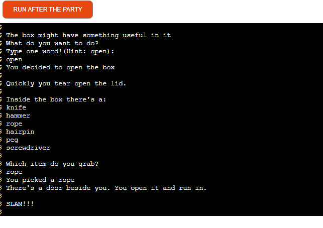

# After the Party
After the Party Live Link [here](https://after-the-party.herokuapp.com/)
## Overview
After the Party is a lighthearted zombie escape game. The player wakes up after a party in an unfamiliar house where everyone else seems to have turned into zombies. The player navigates their way around the house trying to get out safely, choosing to enter different rooms. The player also selects items from a box which help to win the game.
## Features
### Existing Features
* The player chooses the name of whose party they are at and who they came to the party with. These people then appear later in the story.
* The player chooses items from a camping box which then assist in winning the game in various different ways
* The different rooms the player enters have different paths to win or lose 
* Winning is escaping from the house and losing is dying or being killed. The means of winning or losing is told to the player at the end of the game.
### Future Features
* I refactored a lot of code but in the future would also refactor the functions to check the validity of the names. Currently the player is prevented from entering an empty string or a space and is not able to continue without enterring valid text. I would like to find a way to do this by calling one function.
* I would add more rooms, more weapons/tools and more scenarios for escaping/dying.
* I would add some ascii art to enhance user experience

### Run Program button
### Terminal Area
The first screen of the program showing the opening and the first two player inputs of their player name and the part host name/:

A screenshot showing player choosing to 'open' the camping box and the contents list is displayed from which the player selects an item.

The third screenshot shows one way that a player could win.

The fourth screenshot shows one way that a player has died.

### Program Structure
The flowchart created during the planning stage can be viewed [here](https://github.com/siobhanlgorman/After-the-Party/blob/main/assets/images/flowchart.png)

## Technologies
### Languages.. 
  * [Python](https://www.python.org/) Python is a widely used general-purpose, versatile and powerful programming language used for example for web development, machine learning and data science. Python was used to create the command line interface for this text-based game.
### Other Technologies and Libraries
* [Github](https://github.com/) and [Git](https://git-scm.com/) were used for version control
* [Gitpod](https://gitpod.io/) was used as cloud-based IDE
* [Heroku](http://heroku.com/) was used to deploy the app
* [The Google Chrome browser](https://www.google.com/intl/en_ie/chrome/) was used to view the app
* [Diagrams](https://www.diagrams.net/) was used to create the flowchart
## Known Issues/Bugs
* Left/Right option: sometimes won't accept 'Left' or 'left' input but accepts second time and sometimes it does accept as expected. The cause has not been determined so the fix cannot be identified.

* Player was able to continue with game after hitting return instead of entering a valid player name. This was fixed with a while loop and `if not player_name:`. But the player was still able to enter spaces. I experimented with several ways but eventually fixed this by adding an elif statement and the `isspace()` method.

* in landing function user answer is incorrect if more than one word entered e.g open it instead of just open so added prompt 'enter one word'
* in bedroom 2 escape with item other than rope
## Testing
### Validation
Validation of the Python code was carried out by [PEP8](http://pep8online.com/). No errors were found.

### Manual Testing
The options and flow were checked manually and all passed. The tests conducted can be seen [here:](https://docs.google.com/spreadsheets/d/1NUVHJ0VQ0orWFZ3Bh9MgGXAYShW9a5Ki2Rw6T_ssCLE/edit?usp=sharing)

In testing some users had difficulty with the prompt to open the box in landing() so I added a "hint: open!" to the text to avoid frustration
## Deployment
The application uses Heroku for deployement

### To create the application:
1. First create the requirements file the Heroku will use to import the dependencies required for deployment: type `pip3 freeze > requirements.txt`. For this project the requirements.txt file is empty as no libraries or modules were imported other than from the standard python library.
2. Navigate to the [Heroku](https://www.heroku.com/) website
3. create an account by entering your email address and a password
4. Activate the account through the authentication email sent to your email account
5. Click the new button and select create a new app from the dropdown menu
6. Enter a name for the application which must be unique, in this case the app name is after-the-party
7. Select a region, in this case Europe
8. Click create app

### Heroku settings
1. From the horizontal menu bar select 'Settings'.
2. In the buildpacks section, where further necessary dependencies are installed, click 'add buildpack'. Select 'Python' first and click 'save changes'. Next click 'node.js' and then click 'save changes' again. The 'Python' buildpack must be above the 'node.js' buildpack'. They can be clicked on and dragged to change the order if necessary.
### Deployment
1. In the top menu bar select 'Deploy'.
2. In the 'Deployment method' section select 'Github' and click the connect to Github button to confirm.
3. In the 'search' box enter the Github repository name for the project. Click search and then click connect to link the heroku app with the Github repository. The box will confirm that heroku is connected to the repository which in this case is [After the Party](https://github.com/siobhanlgorman/After-the-Party).
4. Scroll down to select either automatic or manual deployment. For this project automatic deployment was selected. If you wish to select automatic deployment select the button 'Enable Automatic Deploys'. This will rebuild the app every time a change is pushed to Github. If you wish to manually deploy click the button 'Deploy Branch'. The default 'Master' option in the dropdown menu should be selected in both cases.
5. When the app is deployed a message 'Your app was successfully deployed' will be shown. Click 'view' to see the deployed app in the browser. The live deployment of the project can be seen [here](https://after-the-party.herokuapp.com/)
6. The app starts automatically and can be restarted by pressing the 'Run Program' button.
### Forking the Repository
If you wish to fork the repository to make changes without affecting the original you can fork the repository
1. Navigate to the [After the Party repository](https://github.com/siobhanlgorman/After-the-Party)
2. Click the 'Fork' button at the top right of the page.
3. A forked copy of the repository will appear in your Repositories page.
### Cloning the Repository
1. On [GitHub](https://github.com/siobhanlgorman/After-the-Party) navigate to the main page of the repository.
2. Above the list of files click the dropdown code menu.
3. Select the https option and copy the link.
4. Open the terminal.
5. Change the current working directory to the desired destination location.
6. Type the git clone command with the copied URL: `git clone https://github.com/siobhanlgorman/After-the-Party.git`.
7. Press enter to create the local clone.

## Credits

### Code

This tutorial was useful for inspiration: [Learn Python by making a text-based adventure game](https://coding-grace-guide.readthedocs.io/en/latest/guide/lessonplans/beginners-python-text-based-adventure.html)

[Stack Overflow](https://stackoverflow.com/) was useful for looking up various solutions to bugs e.g. [whitespace only strings](https://stackoverflow.com/questions/2405292/check-if-string-contains-only-whitespace)
## Content
The story content was developed by this author.