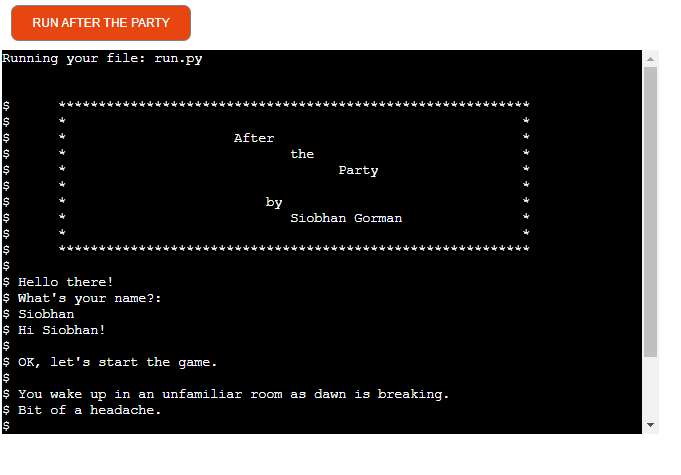
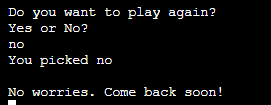
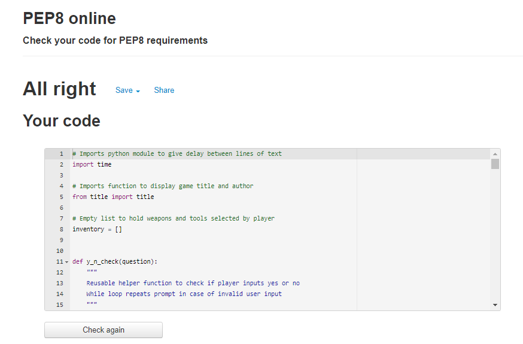

# After the Party
After the Party Live Link [here](https://after-the-party.herokuapp.com/)

Mockup:

## Overview
After the Party is a lighthearted zombie escape game which runs in a mock terminal on Heroku. The player wakes up after a party in an unfamiliar house where everyone else seems to have turned into zombies. They have to find a way to safety out of the house through various rooms and using various weapons or tools.

## How to Play
* After the Party is a text-based adventure game where the player inputs their choice based on prompts. The player then navigates their way around the house trying to get out safely. The player chooses 'Yes' or 'No' to open doors to different rooms, turn 'left' or 'right', and choose 'attack' or 'run'. 
* The player also selects items from a box which help to win the game. There may be red herrings in the box so choose carefully! There may also be unexpected ways to win!

## Features
### Existing Features
1. Run After the Party button: 

* This button starts or restarts the programme. The button was customised from the default 'Run Program' text to 'Run After the Party' in the `index.html` file

2. The game opens with the title and welcome followed by a request for the player to input their name. The programme then greets the player by name.

* The opening screen of the program showing the title and the player's first input which is their player name:

3. The player chooses the name of the party host and the friend they came to the party with. These people then appear later in the story. This is intended to be a source of amusement to engage the user. All three name inputs (Player, Host and Friend) must be in valid text form and cannot be a space or empty or characters other than text. If the player enters a lower case first letter for the name this is accepted and converted to a capital first letter to be grammatically correct. A name must be entered to continue. If an invalid name is entered the prompt is repeated until a valid name is entered.

* Here the player chooses a friend called 'Jane':

* Here the input 'siobhan' is converted to initial capital letter 'Siobhan':

* Here an invalid name has been entered, not accepted and the prompt repeated:

4. The player chooses items from a camping box, most of which then assist in winning the game in various different ways. The player must choose a valid item from the box spelled correctly to continue. The player can choose a second item from the box at a later point and the first item has been removed from the choice offered.

* This shows the player choosing to 'open' the camping box. They could also 'look' or 'see' inside the box. The contents list is displayed from which the player selects an item. Here the player choose 'rope'. The programme then confirms the player's choice and continues the story path:

* Further on in the game the player chooses another item from the box where the first choice has been removed. This shows 'rope' has been removed as selected above:

5. The different rooms the player enters have different paths to win or lose according to their answer choices. 

* This shows the player choosing to open the door and finding themselves in the bathroom:

6. Winning is escaping from the house and losing is dying or being killed. The means of winning or losing is told to the player at the end of the game.

* This shows one way that a player could win with the how they won explained:

* This screenshot shows one way that a player dies.

7. At the end of the game the player is asked if they would like to play again. If they do they game restarts and if not the game stops. Both choices generate a message.

* Here the player chooses to play again:

* Here the player chooses not to play again.

### Future Features
* The yes/no questions were refactored into one helper function as they were the majority of the input options. In the future the functions to check the validity of the three names could happen through one function. Currently the player is prevented from entering an empty string or a space and is not able to continue without entering valid text. This could be done in future by calling one function for all names and more characters could be added.
* More rooms, more weapons/tools and more scenarios for escaping/dying using the different weapons/tools could be added to extend the experience.
* Ascii art could be added to enhance user experience in particular for the 'You Win' and 'You Die' messages.

## Data Model
The data model used in this game is a list. A list of camping box items (`camping_box`) is provided from which the player selects an item twice and each time the item is removed from the camping box list (`camping_box`) and then added to the player's inventory. This item is then used to generate various option in the game which depend on the item selected.
The game also stores three 'name' objects (`player_name`, `friend_name`, and `host_name`) inputted by the player which are then used as characters at different points in the game story.

The main design model of the game is to generate `print` story statements which are determined by the player input.

### Program Structure
The flowchart created during the planning stage can be viewed [here](https://github.com/siobhanlgorman/After-the-Party/blob/main/assets/images/flowchart.png). 

## Technologies
### Languages.. 
* [Python](https://www.python.org/) is an interpreted, object-oriented, versatile and powerful programming language used for example for web development, machine learning and data science. Python3 was used to create the command line interface for this text-based game.
### Other Technologies and Libraries
* [Github](https://github.com/) and [Git](https://git-scm.com/) were used for version control. Github provides the web interface for the Git code repository.
* [Gitpod](https://gitpod.io/) was used as the cloud-based IDE for this project.
* [Heroku](http://heroku.com/) is a containier-based cloud Platform as a service used to deploy, manage and scale modern applications. Heroku was used to deploy this game application.
* [The Google Chrome browser](https://www.google.com/intl/en_ie/chrome/) was used to view the app
* [Diagrams](https://www.diagrams.net/) was used to create the flowchart for this application.

## Known Issues/Bugs

* Left/Right option: sometimes 'Right' or 'right' inputs are not accepted until the second time and sometimes they are accepted the first time as expected. The cause has not been determined as it is intermttent so a fix cannot be identified currently. Update: Fixed - removed additional input from `else` statement in `while` loop.

Not accepting 'right':

Accepting 'right':

* Player was able to continue with game after hitting return instead of entering a valid player name. This was fixed with a while loop and `if not player_name:`. But the player was still able to enter spaces. I experimented with several ways but eventually fixed this by adding an elif statement and the `isspace()` method. In the end to eliminate player inputting e.g.??? I changed I reduced this to the `isalpha()` method instead to fix this.

* In the landing function user answer is incorrect if more than one word entered which is not in list of accepted words or strings e.g 'I would open it' instead of just open so added prompt 'enter one word (hint: open)'. This could be changed in the future if it proved to be problematic for users I would change the function to limit the options but wanted a little variety and to allow the user a little freer choice. Testers had no problem with this in its current form.

* In the living_room function when the player died and declined to play again, after ending the programme generated a fight/run request from a different part of the game. This was because of incorrect indentation which was fixed.

There are no remaining bugs.

## Testing

### Manual Testing
1. The code was passed through the [PEP8](http://pep8online.com/) linter and no errors were found.

2. Manual testing was carried out extensively both in the local Gitpod terminal and also in the Heroku terminal in the Chrome browser. Once testing in the Heroku terminal was conducted line breaks were added to compensate for the width of the screen. The screen width was later adjusted in the css file xterm.css.
3. The options and flow were checked manually and all passed. The list of these tests can be seen [here:](https://docs.google.com/spreadsheets/d/1NUVHJ0VQ0orWFZ3Bh9MgGXAYShW9a5Ki2Rw6T_ssCLE/edit?usp=sharing)

3. In testing some users had difficulty with the prompt to open the box in the landing function so I added a "hint: open" to the text to avoid frustration
4. In early testing it was apparent that a player could enter a space or hit return to enter a player name and still continue. To prevent this I added a function checking for a name and only space (`str.isspace()`) But this allowed the player to enter e.g. 555 or ??? so I changed the method to `str.isalpha()`. It is recognised however that were a player to have a squiggle or other novel element in their name (like the artist formerly known as Prince did) they would not be able to enter this. If this was proven to be an issue it could be addressed in future versions of the game. 
5. The game was tested on various sized screens and browsers including a Dell 15" laptop, 24" monitor, iPhone SE2 and Moto G8+ with no issues.

IPhoneSE2:

Moto G8+:

## Deployment
This application uses Heroku for deployment

### Create the application
1. First create the requirements file the Heroku will use to import the dependencies required for deployment: type `pip3 freeze > requirements.txt`. For this project the requirements.txt file is empty as no libraries or modules were imported other than from the standard python library.
2. Navigate to the [Heroku](https://www.heroku.com/) website
3. create an account by entering your email address and a password
4. Activate the account through the authentication email sent to your email account
5. Click the new button and select create a new app from the dropdown menu
6. Enter a name for the application which must be unique, in this case the app name is after-the-party
7. Select a region, in this case Europe
8. Click create app

### Heroku settings
1. From the horizontal menu bar select 'Settings'.
2. In the buildpacks section, where further necessary dependencies are installed, click 'add buildpack'. Select 'Python' first and click 'save changes'. Next click 'node.js' and then click 'save changes' again. The 'Python' buildpack must be above the 'node.js' buildpack'. They can be clicked on and dragged to change the order if necessary.
### Deployment
1. In the top menu bar select 'Deploy'.
2. In the 'Deployment method' section select 'Github' and click the connect to Github button to confirm.
3. In the 'search' box enter the Github repository name for the project. Click search and then click connect to link the heroku app with the Github repository. The box will confirm that heroku is connected to the repository which in this case is [After the Party](https://github.com/siobhanlgorman/After-the-Party).
4. Scroll down to select either automatic or manual deployment. For this project automatic deployment was selected. If you wish to choose automatic deployment select the button 'Enable Automatic Deploys'. This will rebuild the app every time a change is pushed to Github. If you wish to manually deploy click the button 'Deploy Branch'. The default 'Master' option in the dropdown menu should be selected in both cases.
5. When the app is deployed a message 'Your app was successfully deployed' will be shown. Click 'view' to see the deployed app in the browser. The live deployment of the project can be seen [here](https://after-the-party.herokuapp.com/)
6. The app starts automatically and can be restarted by pressing the 'Run Program' button.
### Forking the Repository
If you wish to fork the repository to make changes without affecting the original you can fork the repository
1. Navigate to the [After the Party repository](https://github.com/siobhanlgorman/After-the-Party)
2. Click the 'Fork' button at the top right of the page.
3. A forked copy of the repository will appear in your Repositories page.
### Cloning the Repository
1. On [GitHub](https://github.com/siobhanlgorman/After-the-Party) navigate to the main page of the repository.
2. Above the list of files click the dropdown code menu.
3. Select the https option and copy the link.
4. Open the terminal.
5. Change the current working directory to the desired destination location.
6. Type the git clone command with the copied URL: `git clone https://github.com/siobhanlgorman/After-the-Party.git`.
7. Press enter to create the local clone.

## Credits

### Code

[Stack Overflow](https://stackoverflow.com/) was useful for looking up various solutions to bugs e.g. [whitespace only strings](https://stackoverflow.com/questions/2405292/check-if-string-contains-only-whitespace)

This tutorial was useful for inspiration: [Learn Python by making a text-based adventure game](https://coding-grace-guide.readthedocs.io/en/latest/guide/lessonplans/beginners-python-text-based-adventure.html)

[Code Institute for the deployment terminal](https://learn.codeinstitute.net/courses/course-v1:CodeInstitute+LS101+2021_T1/courseware/293ee9d8ff3542d3b877137ed81b9a5b/e3b664e16366444c8d722c5d8340b340/)

## Content
The story content was developed by this author [Siobhan Gorman](https://github.com/siobhanlgorman).

## Images

[Techsini](https://techsini.com/multi-mockup/index.php) was used to generate the [mockup](https://github.com/siobhanlgorman/After-the-Party/blob/main/assets/images/responsive.png) image